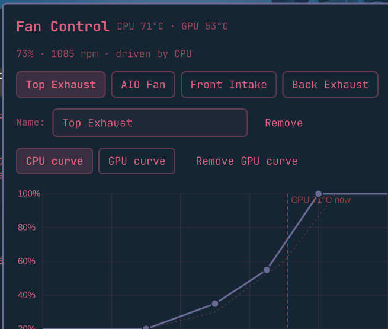

# Fan Control (Omarchy plugin)

A graphical fan-curve editor for [Omarchy](https://omarchy.org)'s
`omarchy-fancontrol` daemon. Windows-FanControl-style graph: drag points to reshape a curve,
manual speed override, per-fan renaming, and add a second curve per fan that
switches in automatically depending on whether the CPU or GPU is a higher temp.



## Features

- Bar pill shows live CPU and GPU temperature at a glance; hover for each
  fan's speed and RPM.
- Click the pill to open the graph editor: drag a point to reshape the
  curve, double-click empty space to add one, double-click a point to
  remove it.
- **Manual override** — pin a fan at a fixed speed, independent of any
  curve.
- **Rename fans** — the auto-detected `<chip>_pwmN` names aren't very
  useful; give each fan a real name ("Top Exhaust", "AIO Fan", ...).
- **Remove a fan** from the config (with confirmation) if detection paired
  it with a header nothing is actually plugged into — hands that pwm back
  to firmware/BIOS auto control.
- **CPU/GPU dual curves** — give a fan a second curve driven by GPU temp;
  the daemon compares CPU vs. GPU temp once per poll (with its own
  hysteresis band, so it doesn't flap right at the crossover) and switches
  every fan that has a GPU curve onto it while the GPU is the hotter one.
  Fans without a GPU curve just keep responding to CPU temp as normal.
- **Copy a curve between fans** — pick another fan from the dropdown and
  copy its CPU (or GPU) curve onto the one you're editing, instead of
  reshaping every fan's curve from scratch.
- **In-panel help** — a "?" button in the header opens a quick FAQ
  (adding/removing curve points, renaming, manual override, GPU curves)

## Requirements

**This plugin needs a patched `omarchy-fancontrol` daemon.** The stock
daemon that ships with Omarchy doesn't know about manual override, GPU
curves, or fan removal/labels — those are daemon-side features, not just
UI. See [`daemon-patches/`](daemon-patches) for the patched
`fancontrold.py` and `fancontrol_detect.py` (a diff against the stock
files, plus install steps). Until/unless this lands upstream in Omarchy
itself, you need to apply those patches via the installer below.

## Install

```bash
omarchy plugin add https://github.com/Nerdvanian/omarchy-fancontrol-plugin.git --enable --yes
```

Then apply the daemon patch (see [`daemon-patches/README.md`](daemon-patches/README.md) for what it does):

```bash
~/.config/omarchy/plugins/nerdvanian.fancontrol/scripts/fancontrol-daemon-install
```

This verifies the patch files against pinned hashes, backs up whatever's
currently installed, applies the patch, and restarts
`omarchy-fancontrol.service` itself — confirming it comes back up healthy
before finishing, and rolling back automatically if it doesn't.

## Uninstall

To remove just the plugin (bar pill + panel), leaving the daemon and your
curves running exactly as they are — you'll lose the graphical editor, but
`omarchy-fancontrol` keeps applying whatever's in `config.yaml`, and you
can still edit it by hand or with `~/.local/share/omarchy-fancontrol/fancontrol-watch`:

```bash
omarchy plugin remove nerdvanian.fancontrol
```

To put the daemon back the way it was before this plugin's installer ever
touched it — undoes the daemon patch (manual override, GPU curves, fan
removal/labels go away) but leaves `omarchy-fancontrol` running your
existing curves:

```bash
~/.config/omarchy/plugins/nerdvanian.fancontrol/scripts/fancontrol-daemon-uninstall --restore
```

This restores from the snapshot `fancontrol-daemon-install` took the first
time it ever ran on this machine, restarts the service, and confirms it
comes back up healthy.

To undo everything, including fan control itself — this hands every pwm
header back to firmware/BIOS auto control:

```bash
omarchy plugin remove nerdvanian.fancontrol
~/.config/omarchy/plugins/nerdvanian.fancontrol/scripts/fancontrol-daemon-uninstall --full
```

`--full` does the restore above, then stops and disables
`omarchy-fancontrol.service` and removes `~/.config/omarchy-fancontrol`.
Stopping the service restores each pwm's original `pwm_enable` value
automatically (that's built into the daemon, not something this cleanup
does) — the fans return to normal firmware control the moment it stops.

If the daemon patch was never applied via `fancontrol-daemon-install` (no
snapshot to restore from), `--full` skips the restore step and just
disables the service and removes the config — same end state as manually
running `sudo systemctl disable --now omarchy-fancontrol.service && rm -rf
~/.config/omarchy-fancontrol`.

## Files

| Path | What it is |
|---|---|
| `manifest.json` | Plugin registration |
| `BarWidget.qml` | The bar pill |
| `Panel.qml` | The popup: tabs, graph wiring, manual/rename/remove controls |
| `CurveGraph.qml` | The draggable curve graph itself |
| `scripts/fancontrol-graph-data` | Reads `config.yaml` + daemon status for the panel |
| `scripts/fancontrol-graph-write` | Writes panel edits back to `config.yaml` |
| `daemon-patches/` | Patched daemon files this plugin depends on (see above) |
| `backup/config.yaml` | A worked example (the author's own curves) — not applied automatically |

## Development notes

- Structural QML changes (new properties, new child items) inside an
  already-open panel don't reliably hot-reload — Quickshell's
  "Local plugin changed" live-reload only refreshes the plugin registry,
  not an already-mounted `Loader`'s content. Run `omarchy restart shell`
  after editing `Panel.qml`/`CurveGraph.qml`/`BarWidget.qml` before
  judging whether a change worked.
- The daemon (`fancontrold.py`) only reloads `config.yaml` on save (hot);
  it does **not** reload its own source — restart the systemd service
  after editing it.
